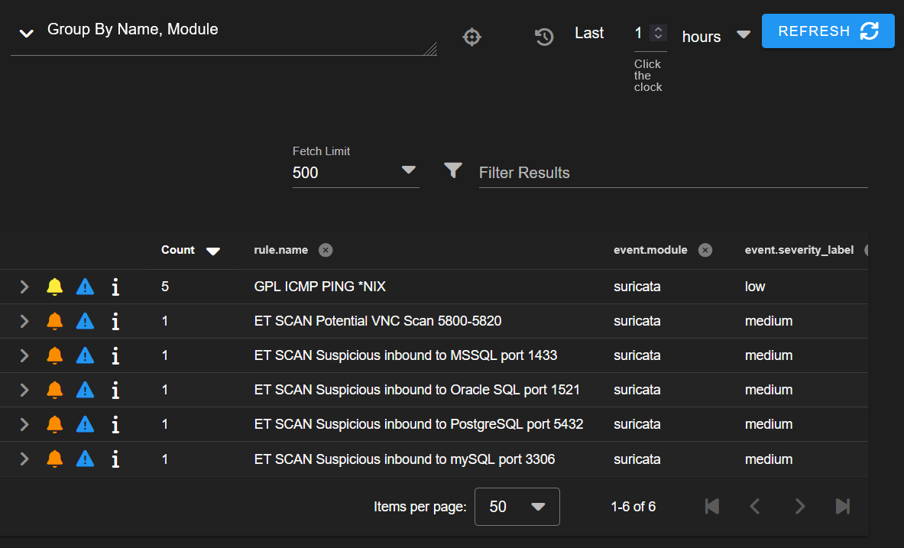

# Network Attack Simulation – Detection with Security Onion

## Overview

Basic network attack simulations were performed from the attacker machine to a vulnerable server to generate detectable traffic within the SOC lab.

The activity was monitored and analyzed using Security Onion.

---

## Environment

* Attacker: Kali Linux
* Target: Metasploitable 2
* Monitoring Platform: Security Onion

---

## Attack Simulation

### 1. Network Scan (Nmap)

A network scan was performed to identify open ports and services on the target system.

```id="kq2j9v"
nmap 192.168.1.10
```


This generates detectable scanning activity across multiple ports.

---

### 2. ICMP Traffic (Ping)

Basic ICMP requests were sent to the target system to generate network traffic.

```id="6xt9rj"
ping 192.168.1.10
```

---

## Detection & Monitoring

The generated traffic was captured and analyzed using Security Onion.



### Observations

* Nmap scan activity generated alerts related to port scanning
* ICMP traffic was visible in network monitoring tools
* Alerts and logs were accessible through Security Onion dashboards

---

## Validation

* Confirmed traffic visibility in Security Onion
* Verified alerts corresponding to scan activity
* Observed source (Kali) and destination (Metasploitable) communication

---

## Purpose

This simulation demonstrates:

* How reconnaissance activity appears in network monitoring tools
* Detection of scanning behavior in a monitored environment
* Basic validation of IDS functionality within the SOC lab

This is the first step toward building more advanced attack and detection scenarios.
